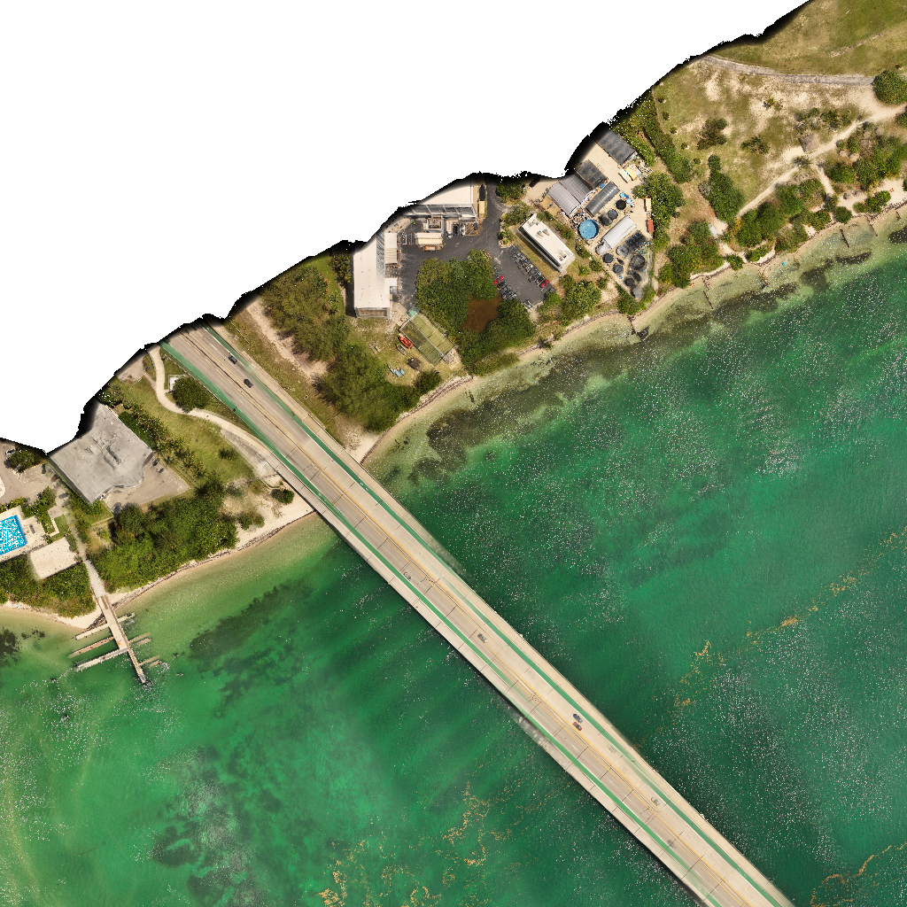
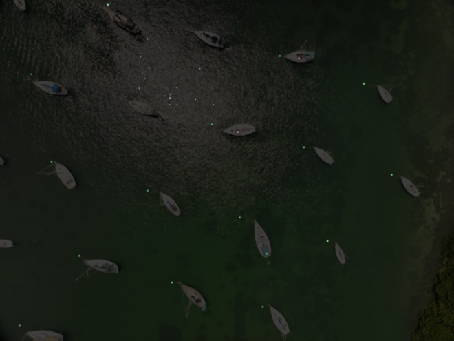

# SeaScan

Constructing maps of flat regions should be a relatively simple task, but conventional approaches require complicated structure-from-motion pipelines intended for full 3D reconstruction.
These methods often fail on scenes without distinguishable details, such as the ocean. We overcome this limitation through the use of target(s) and GPS data to stitch maps that are focused at a singular depth.

### Map of Waters Near the Rosenstiel School using the MAVIC 3E

 
<video controls src="./figures/rectified_timelapse_small.mp4" width=300></video>

<!-- <iframe
  src="https://www.youtube.com/embed/PaGTsykrcSk"
  frameborder="0"
  allowfullscreen>
</iframe> -->

## Products

We present two methods of map generation depending on the amount of how much processing that should be done during or before viewing.

### Folium Map
The simplest and quickest result is a map made with folium. It populates a map with a subset of downsampled images stacked on top of each other. While this is quick to generate, the tiles overlap, and your browser may switch between these tiles.

<iframe
  src="https://npikielny.github.io/SeaScan/march_20_folium.html"
  frameborder="0"
  width=100%
  height=500px
  allowfullscreen>
</iframe>

This particular result uses fewer images, at a lower resolution, to work with Github.

### Stitched Image
Using our derived GPS transformation, we can stitch together high-quality images with limited noise from glint and parallax. This work is ongoing and the transforms of the corresponding geotiffs need correction.

 
 

### Timelapse Videos
Lastly, we can collate data around a particular region to get an idea of the 3D shape, as well as an idea of the accuracy of our GPS to image mapping. Notice in May 1, the image transform is slightly off, so objects on the sea surface appear to move.

<video controls src="./figures/rectified_timelapse_small.mp4" width=300></video>
<video controls src="./figures/boats_timelapse.mp4" width=300></video>

### Requirements
1. Sea Surface Target

Our method was designed to automatically detect mooring buoys for boats; however, manually isolating a target in just a few images yields similar results. 
Thus, our method can be used on any type of target with minimal effort. 

2. GPS Data

Our method uses GPS data, as well as gimbal heading data, to align images. We designed with the Mavic 3E in mind, so the metadata should be found at `GimbalYawDegree` and `GimbalPitchDegree`.
However, if these do not suit your data, you can edit the `gps.py` file.

3. Camera Calibration (optional)

In designing for the Mavic 3E, we also included parameters for its image undistortion. We included a notebook that leverages [OpenCV checkerboard camera calibration](https://docs.opencv.org/3.4/dc/dbb/tutorial_py_calibration.html). This can be found in `Calibration.ipynb`.

 
 

> # [You can find our code here!](https://github.com/Npikielny/SeaScan)